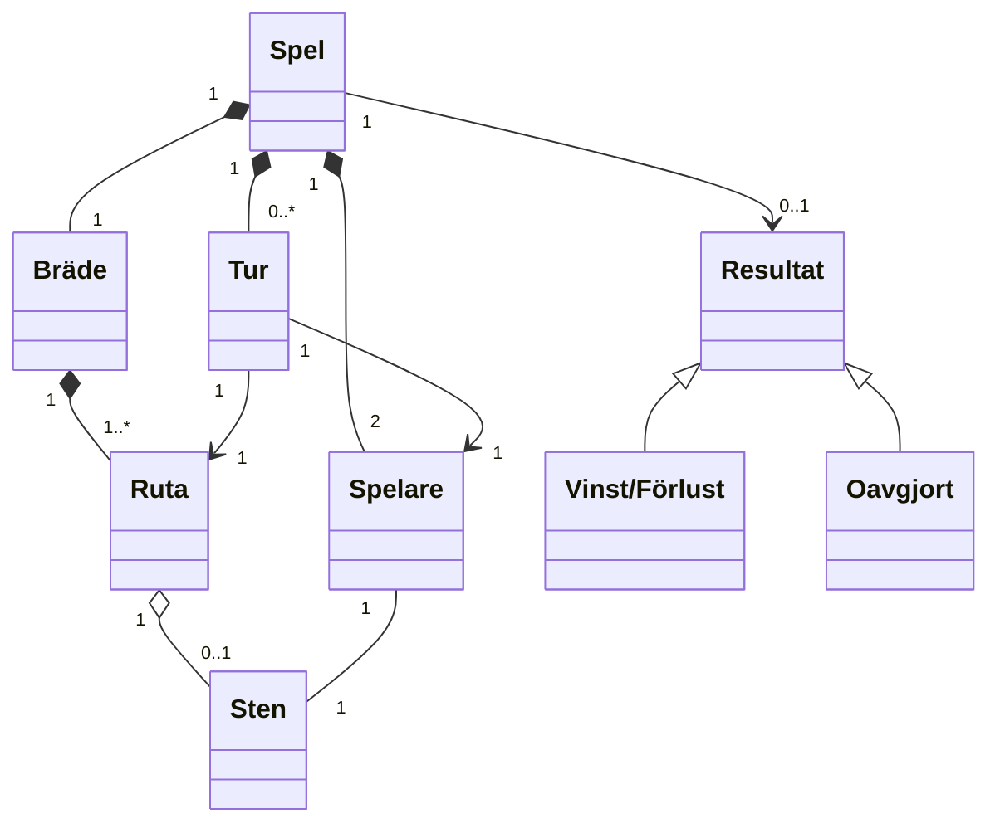

```mermaid
classDiagram
    direction TB

    class Spel {
    }

    class Spelare {
    }

    class Bräde {
    }

    class Ruta {
    }

    class Sten {
    }

    class Tur {
    }

    class Resultat {
    }

    class `Vinst/Förlust` {
    }

    class Oavgjort {
    }

    %% Relationer
    Spel "1" *-- "2" Spelare
    Spel "1" *-- "1" Bräde
    Spel "1" *-- "0..*" Tur
    Spel "1" --> "0..1" Resultat

    Resultat <|-- `Vinst/Förlust`
    Resultat <|-- Oavgjort

    Bräde "1" *-- "1..*" Ruta
    Ruta "1" o-- "0..1" Sten

    Tur "1" --> "1" Spelare
    Tur "1" --> "1" Ruta

    Spelare "1" -- "1" Sten
```