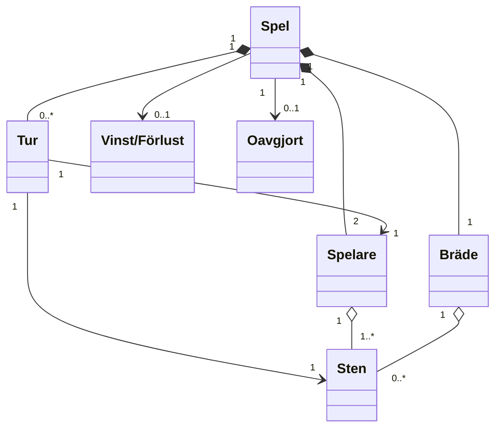

```mermaid
classDiagram
    direction TB

    class Spel {
    }

    class Spelare {
    }

    class Tur {
    }

    class Bräde {
    }

    class Sten {
    }

    class `Vinst/Förlust` {
    }

    class Oavgjort {
    }

    %% Relationer
    Spel "1" *-- "2" Spelare
    Spel "1" *-- "1" Bräde
    Spel "1" *-- "0..*" Tur

    Tur "1" --> "1" Spelare
    Tur "1" --> "1" Sten

    Spelare "1" o-- "1..*" Sten
    Bräde "1" o-- "0..*" Sten

    Spel "1" --> "0..1" `Vinst/Förlust`
    Spel "1" --> "0..1" Oavgjort
```