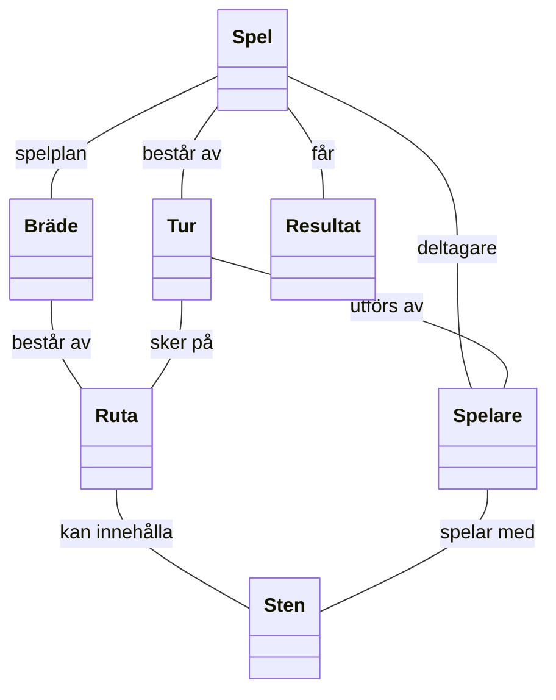

```mermaid
classDiagram
    direction TB

    class Spel {
    }

    class Spelare {
    }

    class Bräde {
    }

    class Ruta {
    }

    class Sten {
    }

    class Tur {
    }

    class Resultat {
    }

    %% Relationer
    Spel -- Spelare : deltagare
    Spel -- Bräde : spelplan
    Spel -- Tur : består av
    Spel -- Resultat : får
    Bräde -- Ruta : består av
    Ruta -- Sten : kan innehålla
    Tur -- Spelare : utförs av
    Tur -- Ruta : sker på
    Spelare -- Sten : spelar med
```