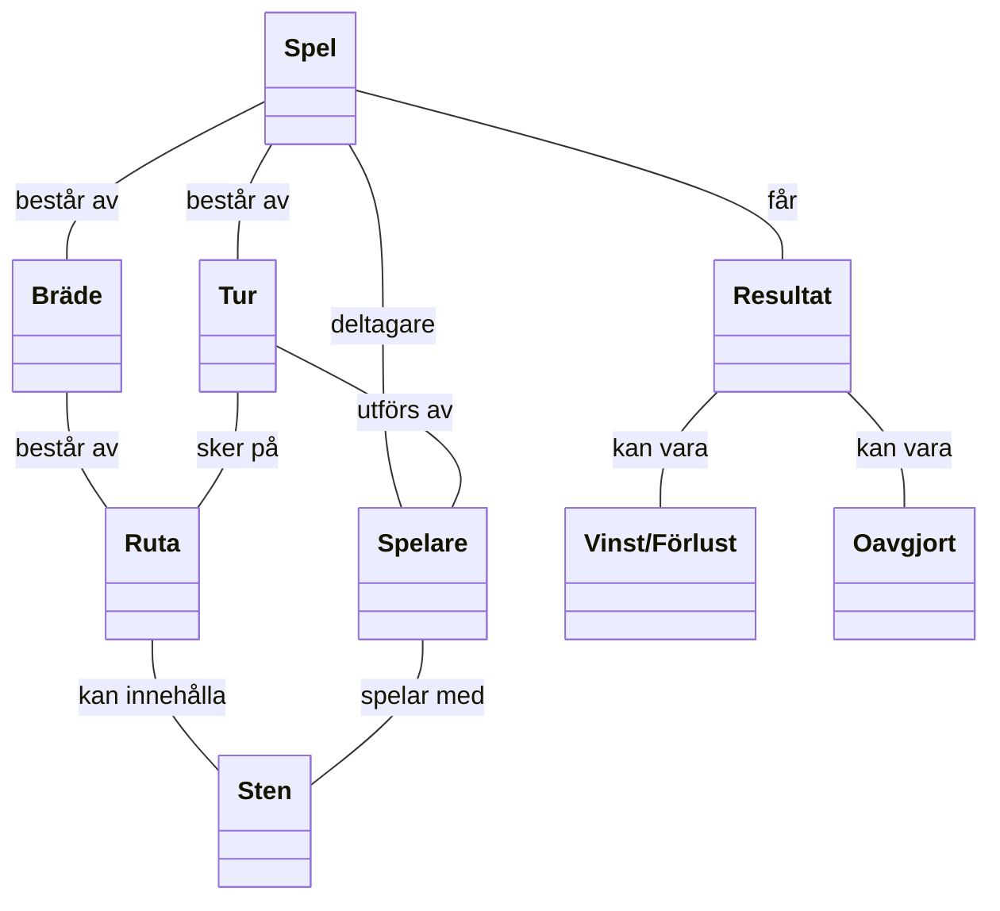

#### Spel
Spel är en enskild spelomgång av Gomoku

#### Spelare
Aktor som agerar i spelet

#### Bräde
Spelplan där spelet genomförs

#### Ruta
Unik punkt på brädet som man kan placera sten på

#### Sten
Spelmärke som spelare placerar i rutor

#### Tur
En Handling i spelomgång

#### Resultat
Slutliga tillstånd

#### Vinst/Förlust
Match som slutade med en spelare som placerade 5 stenar horizontalt, vertikalt och diagonal

#### Oavgjort
Matchen där ingen av spelare kunde placera 5 stenar horizontalt, vertikalt och diagonal