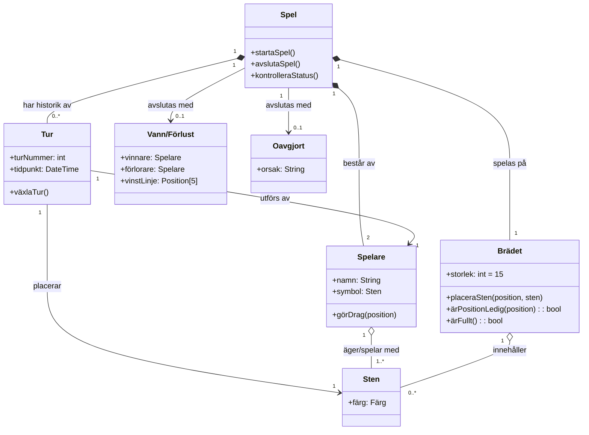

# Gomoku (Luffarschack) - Domänmodell

Denna domänmodell beskriver entiteterna och deras relationer i ett **Gomoku** (Luffarschack)-spel.

## Domänmodellsdiagram (Mermaid)

---

## Beskrivning av Domänentiteter

### 1. Spel (Game)
Representerar en pågående eller avslutad Gomoku-session. Ansvarar för att hålla reda på spelets tillstånd, hantera turer och avgöra när spelet nått ett slutgiltigt resultat (Vann/Förlust eller Oavgjort).

### 2. Spelare (Player)
Representerar en av de två deltagarna i spelet. Varje spelare tilldelas en specifik stenfärg (t.ex. Svart eller Vit) och gör drag under sin tur.

### 3. Tur (Turn)
Representerar ett enskilt drag i spelet. Varje tur kopplas till den spelare som utförde draget samt den sten som placerades på brädet.

### 4. Brädet (Board)
Representerar spelplanen (standardstolek är $15 \times 15$ korsningar). Håller reda på vilka positioner som är täckta av stenar och validerar om en position är giltig och ledig.

### 5. Sten (Piece/Stone)
Representerar de fysikaliska/logiska markörerna (Svart eller Vit) som placeras på brädets korsningar.

### 6. Vann/Förlust (Win/Loss)
Ett möjligt slutresultat för spelet. Inträffar när en spelare lyckas placera fem stenar i rad (horisontellt, vertikalt eller diagonalt).

### 7. Oavgjort (Draw)
Ett alternativt slutresultat för spelet. Inträffar oftast när brädet är helt fullt utan att någon spelare har fått fem i rad.
